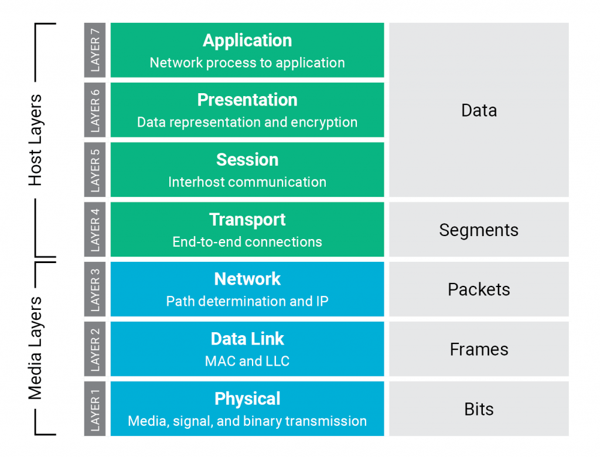

**Nama  :** Jordan Frisay Himawan  
**NRP   :** 3122600007  
**Kelas :** 2 D4 IT A  

`Tugas ini merupakan tugas mata kuliah Konsep Jaringan yang dibimbing oleh Bpk. Dr. Ferry Astika Saputra, ST, M.Sc`

# 7 OSI Layer 
---

#### :bulb: Apa Itu OSI?
Model OSI (Open System Interconnection) diciptakan oleh International Organization for Standardization yang menyediakan kerangka logika terstruktur bagaimana proses komunikasi data berinteraksi melalui jaringan. Dahulu komunikasi data  melibatkan komputer-komputer dari vendor berbeda yang menggunakan protokol dan format yang berbeda juga. Sehingga ISO membuat suatu arsitektur komunikasi yang dikenal sebagai model OSI yang mendefinisikan standar untuk menghubungkan komputer-komputer dari vendor yang berbeda.

Secara umum, penjelasan masing-masing layer adalah sebagai berikut:

**1. Physical Layer**
Untuk mendefinisikan media transmisi jaringan, sinkronisasi bit, arsitektur jaringan (seperti Ethernet), topologi jaringan dan pengkabelan. Selain itu, level ini juga mendefinisikan bagaimana Network Interface Card (NIC) dapat berinteraksi dengan media kabel atau radio. Data biner dikodekan dalam bentuk yang dapat ditransmisi melalui media jaringan, sebagai contoh kabel, transceiver dan konektor yang berkaitan dengan layer Physical. Peralatan seperti repeater, hub dan network card berada pada layer ini

**2. Data-link Layer**
Untuk menentukan bagaimana bit-bit data dikelompokkan menjadi format yang disebut sebagai frame. Selain itu, pada level ini terjadi koreksi kesalahan, flow control, pengalamatan perangkat keras seperti halnya Media Access Control Address (MAC Address), dan menetukan bagaimana perangkat-perangkat jaringan seperti hub, bridge, repeater, dan switch layer 2 beroperasi. Spesifikasi IEEE 802, membagi level ini menjadi dua level anak, yaitu lapisan Logical Link Control (LLC) dan lapisan Media Access Control (MAC). Fungsi LLC adalah menyiapkan sebuah pentrasmisian kembali dari kegagalan paket ketika terindikasi. Sedangkan fungsi lapisan MAC adalah mengkoordinasikan akses langsung terhadap lapisan fisik dengan tergantung metode media access controlnya.

**3. Network Layer**
Untuk mendefinisikan alamat-alamat IP dan menyediakan fungsi routing sehingga paket dapat dikirim keluar dari segment network lokal ke suatu tujuan yang berada pada suatu network lain. Contoh protocol yang digunakan seperti IP

**4. Transport Layer**
Untuk memecah data ke dalam paket-paket data serta memberikan nomor urut ke paket-paket tersebut sehingga dapat disusun kembali pada sisi tujuan setelah diterima. Selain itu, pada level ini juga membuat sebuah tanda bahwa paket diterima dengan sukses (acknowledgement), dan mentransmisikan ulang terhadap paket-paket yang hilang di tengah jalan.
Layer transport data, menggunakan protocol seperti UDP dan TCP. Layer ini menyediakan transfer yang reliable dan transparan antara kedua titik akhir, layer ini juga menyediakan multiplexing, kendali aliran dan pemeriksaan error serta memperbaikinya.

**5. Session Layer**
Untuk mendefinisikan bagaimana koneksi dapat dimulai, dipelihara, atau diakhiri. Beberapa protocol pada layer ini: NETBIOS: suatu session interface dan protocol, dikembangkan oleh IBM, yang menyediakan layanan ke layer presentation dan layer application. NETBEUI, (NETBIOS Extended User Interface), suatu pengembangan dari NETBIOS yang digunakan pada produk Microsoft networking, seperti Windows NT dan LAN Manager. ADSP (AppleTalk Data Stream Protocol). PAP (Printer Access Protocol), yang terdapat pada printer Postscript untuk akses pada jaringan AppleTalk.

**6. Presentation Layer**
Untuk mentranslasikan data yang hendak ditransmisikan oleh aplikasi ke dalam format yang dapat ditransmisikan melalui jaringan. Protokol yang berada dalam level ini adalah perangkat lunak redirektor (redirector software), seperti layanan Workstation (dalam Windows NT) dan juga Network shell.

**7. Application Layer**
Sebagai antarmuka dengan aplikasi dengan fungsionalitas jaringan, mengatur bagaimana aplikasi dapat mengakses jaringan, dan kemudian membuat pesan-pesan kesalahan. Protokol yang berada dalam lapisan ini adalah HTTP, FTP, SMTP, dan NFS.

#### :memo: Fungsi dan Cara Kerja
Meskipun dalam praktiknya kita jarang berhubungan langsung dengan model OSI, namun model ini selalu digunakan oleh network engineer dalam melakukan analisis dan troubleshooting.
Berikut adalah rangkuman fungsi dan cara kerja OSI secara singkat:

> **Fungsi OSI**:

- **Physical**: Menentukan tegangan, kecepatan, besaran fisik, dan mengalirkan bit-bit antar device.
- **Data link**: Menyediakan akses ke media menggunakan MAC Address dan melakukan deteksi error.
- **Network**: Menyediakan logical addressing dan menentukan rute menuju tujuan.
- **Transport**: Menyediakan reliable atau unreliable delivery dan mengecek error pada koneksi.
- **Session**: Memisahkan data dari berbagai aplikasi.
- **Presentation**: Menyajikan data dan menangani proses seperti enkripsi data.
- **Application**: Menyediakan tampilan pengguna atau user interface.

> **Cara kerja OSI**:

1. Informasi berawal dari layer Application. Informasi kemudian melewati layer presentation dan layer session. Pada tahap ini biasanya belum dilakukan transformasi data. Informasi yang melalui ketiga layer ini disebut PDU (Protocol Data Unit) atau data saja.
2. Setelah sampai di layer Transport, data akan mengalami transformasi ke bentuk lain yang disebut segmen.
3. Segmen mengalir ke layer network dan kemudian diubah menjadi packet.
4. Packet mengalir ke layer data link dan kemudian diubah menjadi frame.
5. Terakhir, frame mengalir ke layer physical dan kemudian diubah menjadi bits atau bit-bit.
6. Pada layer ini, bit-bit diubah menjadi besaran fisik, seperti arus listrik, gelombang elektromagnetik, dan sebagainya.

Proses perubahan bentuk dari satu layer ke layer berikutnya dilakukan dengan menambahkan **header** khusus yang disebut dengan **enkapsulasi**. Proses enkapsulasi terjadi berulang hingga data diubah menjadi bit-bit. Kemudian bit-bit ini dikirim ke host target melalui media jaringan.

Setelah data (berupa bit-bit) sampai di host target maka proses kebalikannya, yaitu melepas header satu per satu dari layer terbawah hingga layer paling atas dilakukan. Proses melepas header ini disebut **de-enkapsulasi**.

# TCP/IP (Transmission Control Protocol/Internet Protocol)
---

#### :bulb: Apa Itu TCP/IP?
TCP/IP adalah standar komunikasi data yang digunakan oleh komunitas internet dalam proses tukar-menukar data dari satu komputer ke komputer lain di dalam jaringan Internet. Protokol ini tidaklah dapat berdiri sendiri, karena memang protokol ini berupa kumpulan protokol (protocol suite). Protokol ini juga merupakan protokol yang paling banyak digunakan saat ini. Data tersebut diimplementasikan dalam bentuk perangkat lunak (software) di sistem operasi. Istilah yang diberikan kepada perangkat lunak ini adalah TCP/IP stack.

Protokol TCP/IP dikembangkan pada akhir dekade 1970-an hingga awal 1980-an sebagai sebuah protokol standar untuk menghubungkan komputer-komputer dan jaringan untuk membentuk sebuah jaringan yang luas (WAN). Protokol ini menggunakan skema pengalamatan yang sederhana yang disebut sebagai alamat IP (IP Address) yang mengizinkan hingga beberapa ratus juta komputer untuk dapat saling berhubungan satu sama lainnya di Internet. Protokol ini juga bersifat routable yang berarti protokol ini cocok untuk menghubungkan sistem-sistem berbeda (seperti Microsoft Windows dan keluarga UNIX) untuk membentuk jaringan yang heterogen.

#### :memo: Keunggulan TCP/IP
- Tersedia secara bebas dan dikembangkan independen terhadap komputer atau sistem operasi apapun, sehingga ideal untuk menyatukan berbagai macam hardware dan software.
- Independen dari physical network hardware yang menjadikan TCP/IP dapat mengintegrasikan berbagai macam network.
- Skema addressing yang umum sehingga device yang menggunakan TCP/IP dapat menghubungi alamat device lain di seluruh network.
- High level protocol standard yang dapat melayani user secara luas.

#### :memo: Macam-Macam Layer pada TCP/IP
**1. Link Layer**
Link Layer merupakan gabungan antara Data Link dan Physical layer. Protokol pada layer ini menyediakan media bagi system untuk mengirimkan data ke device lain yang terhubung secara langsung.

**2. Internet Layer**
Diatas Network Access Layer adalah Internet Layer. Internet Protocol adalah jantung dari TCP/IP dan protokol paling penting pada Internet Layer. Seluruh protokol, diatas dan dibawah Internet layer, menggunakan Internet Protokol untuk mengirimkan data. Semua data TCP/IP mengalir melalui IP, baik incoming maupun outgoing, dengan mengabaikan tujuan terakhirnya.

**3. Transport Layer**
Dua protokol utama pada layer ini adalah Transmission Control Protocol (TCP) dan User Datagram Protocol (UDP). TCP menyediakan layanan pengiriman data handal dengan end-to-end deteksi dan koreksi kesalahan. UDP menyediakan layanan pengiriman datagram tanpa koneksi (connectionless) dan low-overhead. Kedua protokol ini mengirmkan data diantara Application Layer dan Internet Layer.

**4. Application Layer**
Pada sisi paling atas dari arsitektur protokol TCP/IP adalah Application Layer. Layer ini termasuk seluruh proses yang menggunakan transport layer untuk mengirimkan data. Banyak sekali application protocol yang digunakan saat ini. Beberapa diantaranya adalah :
- FTP, File Transfer Protocol, digunakan untuk file transfer.
- SMTP, Simple Mail Transfer Protocol, dugunakan untuk mengirimkan electronic mail.
- DNS, Domain Name Service, untuk memetakan IP Address ke dalam nama tertentu.
- NFS, Network File System, untuk sharing file terhadap berbagai host dalam jaringan.
- HTTP, Hyper Text Transfer Protokol, protokol untuk web browsing.
- Dan lain-lain.