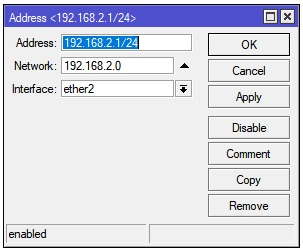
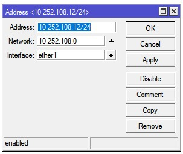
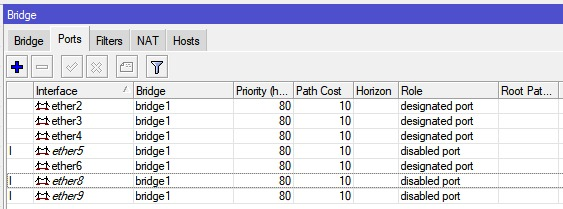
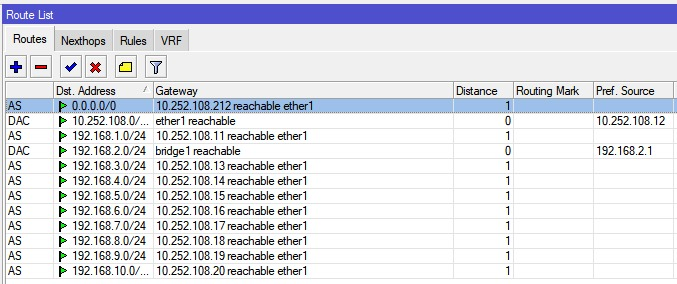
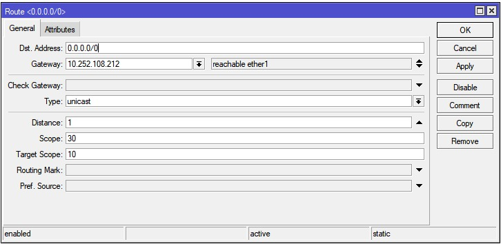
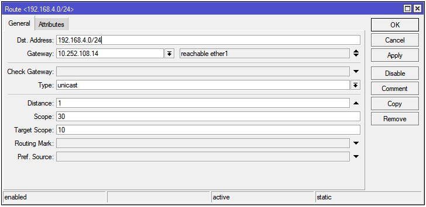
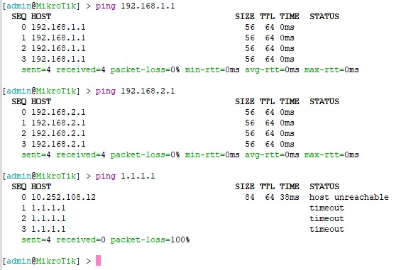

**Nama  :** Jordan Frisay Himawan  
**NRP   :** 3122600007  
**Kelas :** 2 D4 IT A  

`Tugas ini merupakan tugas mata kuliah Konsep Jaringan yang dibimbing oleh Bpk. Dr. Ferry Astika Saputra, ST, M.Sc`

# Configure Mikrotik using Winbox
## 1. Set Own Adrress
### Address for Router

### Address for the router above it

## 2. Add & Set Bridge

## 3. Set Other Address
to set each other Address we need to add in route lists :

this 0.0.0.0 is to connect out microtik to internet. this is example to setting to configure it :

this example to connect to other microtik in the lab : 

## 4. Result

after we configure all on the top,  we try to check the signal & network whether it is connected or not using the **ping** command

