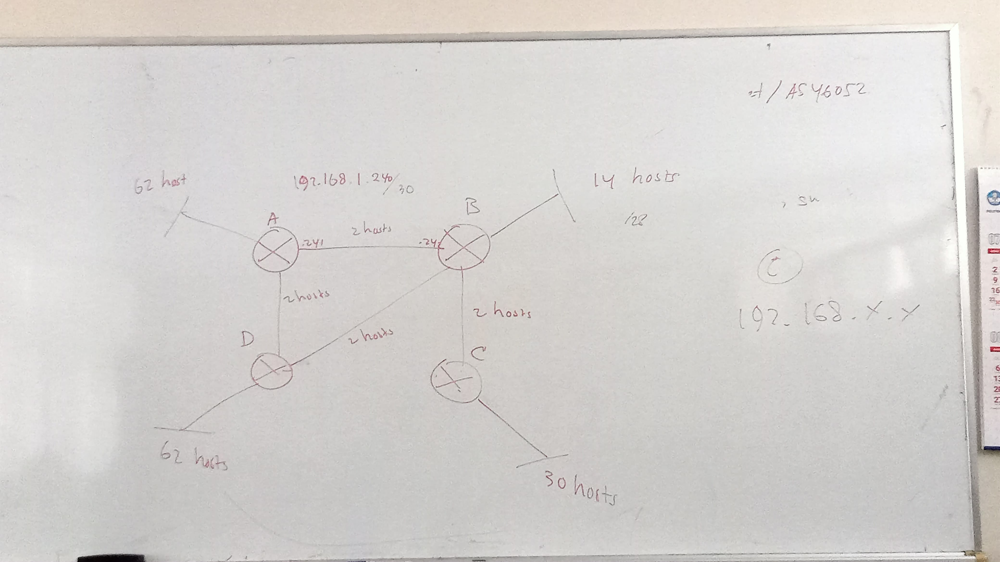

**Nama  :** Jordan Frisay Himawan  
**NRP   :** 3122600007  
**Kelas :** 2 D4 IT A  

`Tugas ini merupakan tugas mata kuliah Konsep Jaringan yang dibimbing oleh Bpk. Dr. Ferry Astika Saputra, ST, M.Sc`

# Subnetting Router
## Task
membuat 4 Router seperti di bawah dengan subnetting sesuai yang ditentukan dengan host yang digunakan, dan semua menggunakan kelas C

---

## Result

---

#### Router 0 Static

#### Router 1 Static

#### Router 2 Static

#### Router 3 Static

---

### Perhitungan Antar Router

### Perhitungan Jika 14 PC (diatas) & 30 PC (dibawah)

### Perhitungan Jika 62 PC 
