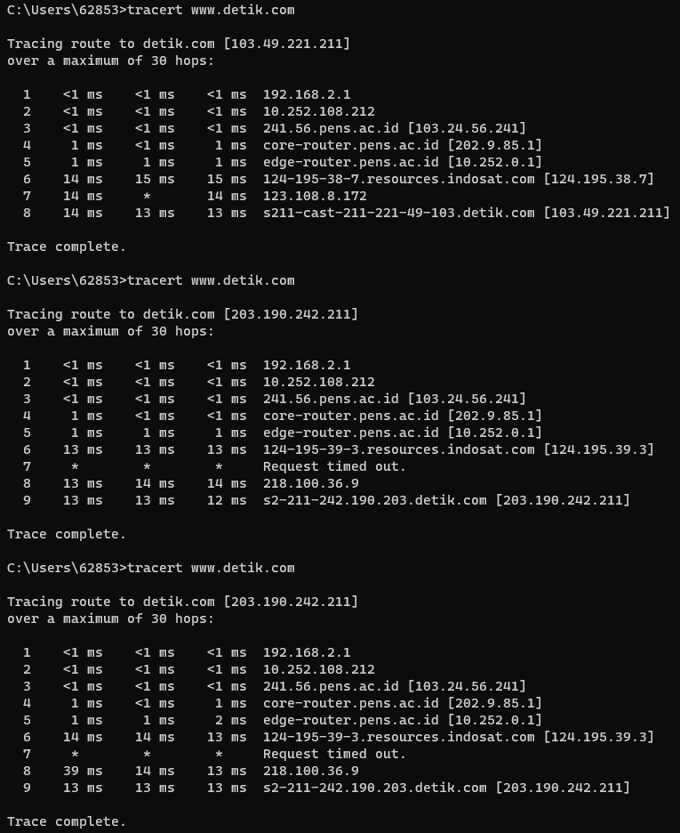
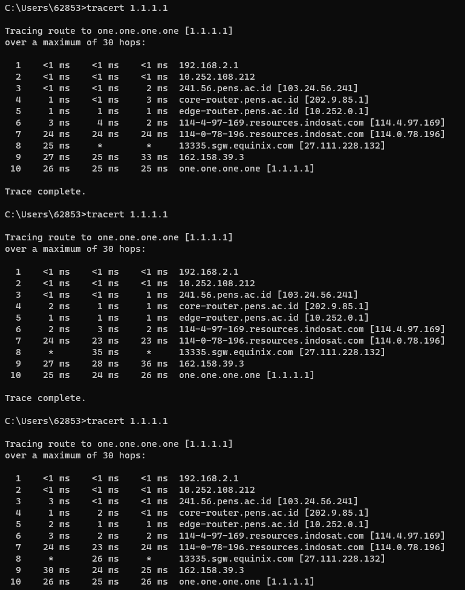
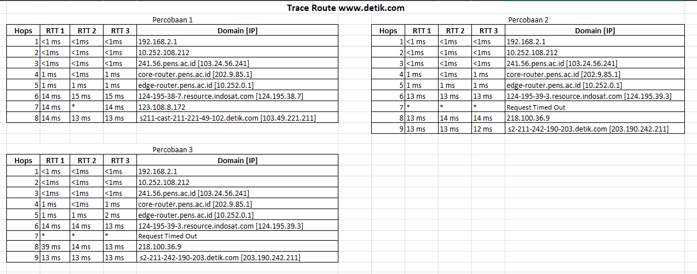
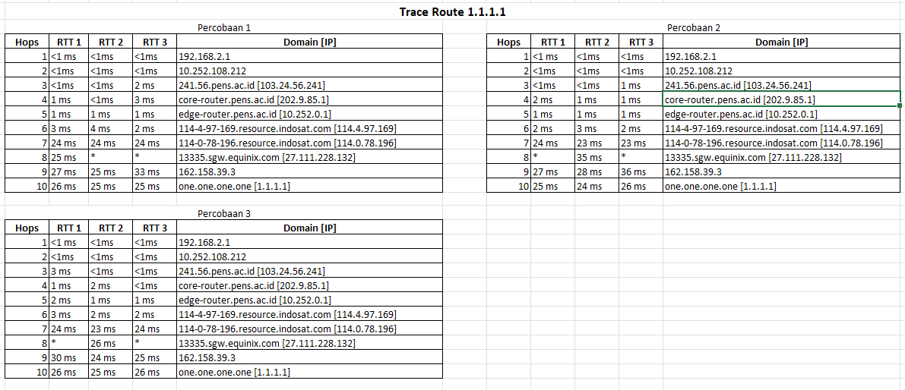

**Nama  :** Jordan Frisay Himawan  
**NRP   :** 3122600007  
**Kelas :** 2 D4 IT A  

`Tugas ini merupakan tugas mata kuliah Konsep Jaringan yang dibimbing oleh Bpk. Dr. Ferry Astika Saputra, ST, M.Sc`

# Traceroute Test

## Cara Kerja

Tracert bekerja dengan cara melacak trace route suatu jaringan. Pelacakan tersebut dilakukan dengan mengirimkan paket Internet Control Message Protocol (ICMP). Paket ini, berfungsi untuk memberikan informasi apakah router yang digunakan dalam perjalanannya dapat mentransfer data secara efektif atau tidak.

## Tracert to [www.detik.com](http://www.detik.com)

## Tracert to 1.1.1.1

## Analisis

Hop diberi nomor di sisi kiri jendela laporan, seperti “1” “2” “3” dan seterusnya. Pada kasus ini, hop nomor 1-5 masih berada didalam lingkup PENS, baru setelah itu menuju ISP hingga ke tujuan.

Selain itu, ada juga tiga pengukuran waktu (RTT) ditampilkan dalam milidetik, yang akan memberitahu lamanya waktu untuk mengirim paket ICMP dari perangkatmu ke suatu router hingga kembali lagi. Pengukuran dilakukan 3 kali dengan tujuan menjaga konsistensi. Pengukuran waktu ada pada kolom ke 2-4.

Setiap baris dalam laporan tracert juga memiliki nama domain serta alamat IP milik router. Domain/IP berada pada kolom ke 5.

Dalam prosesnya, pengecekan tracert tidak selalu berjalan lancar. Berikut ini istilah kendala yang mungkin terjadi saat melakukan tracert:

1. Tanda bintang (*)
Terkadang hop menampilkan tanda bintang (*) yang artinya server pada hop tersebut tidak merespon permintaan tracert. Jika muncul sekali, kamu bisa menunggu respon di hop selanjutnya. Namun, jika muncul beberapa bintang, kemungkinan server sedang bermasalah.
2. Request Time Out
Jika saat melakukan traceroute menampilkan “request time out”, itu artinya server pada hop tersebut tidak menerima ICMP. Hal ini dapat terjadi karena server sedang sibuk.
3. Destination net unreachable
Ini berarti ICMP tidak bisa menuju ke rute pertama. Hal ini biasanya terjadi karena salah memasukkan URL server tujuan atau pengaturan jaringan yang tidak sesuai.

Pada kasus ini, hanya terdapat dua jenis kendala yakni tanda bintang(*) dan "request time out".

## Perbandingan percobaan

3 kali percobaan tracert menuju [www.detik.com](http://www.detik.com) dan 1.1.1.1. Pada tiap percobaan, RTT dan banyak hop tidak selalu sama.
Beberapa alasan mengapa RTT dan jumlah hop dapat bervariasi antar percobaan traceroute:

1. Variabilitas Jaringan
Jaringan internet bersifat dinamis dan dapat mengalami fluktuasi dalam kinerjanya. Lalu lintas jaringan, beban server, dan kondisi jaringan secara keseluruhan dapat berubah dari waktu ke waktu.

2. Rute Dinamis
Jaringan internet menggunakan rute dinamis, yang berarti bahwa rute yang diambil oleh paket data dapat berubah tergantung pada kondisi jaringan saat itu. Rute yang diambil oleh paket pada satu waktu mungkin tidak sama dengan rute pada waktu yang berbeda.

3. Firewall atau Filter Jaringan
Beberapa hop mungkin dilindungi oleh firewall atau filter jaringan yang dapat menyebabkan variasi dalam waktu yang diperlukan untuk mencapai hop tersebut.

4. Multipath Routing
Beberapa rute mungkin dapat diambil oleh paket data melalui Multipath Routing di mana paket dibagi-bagi dan dikirim melalui jalur yang berbeda. Ini dapat menyebabkan variasi dalam RTT dan jumlah hop antar percobaan.

5. Penggunaan Cache
Beberapa hop atau perangkat mungkin menyimpan data di cache untuk meningkatkan kinerja. Penggunaan cache dapat memengaruhi RTT pada percobaan traceroute yang berbeda.

6. Kesalahan Pengukuran
Beberapa variasi mungkin juga disebabkan oleh kesalahan pengukuran, entah itu karena perbedaan dalam waktu sistem, latensi yang sangat kecil, atau faktor-faktor teknis lainnya.

Penting untuk dicatat bahwa sedikit variasi dalam RTT dan jumlah hop antar percobaan normal tergantung pada kondisi jaringan yang dinamis. Jika ada perbedaan yang signifikan atau masalah konsisten, itu mungkin mengindikasikan masalah dalam jaringan atau rute yang diambil oleh paket data.