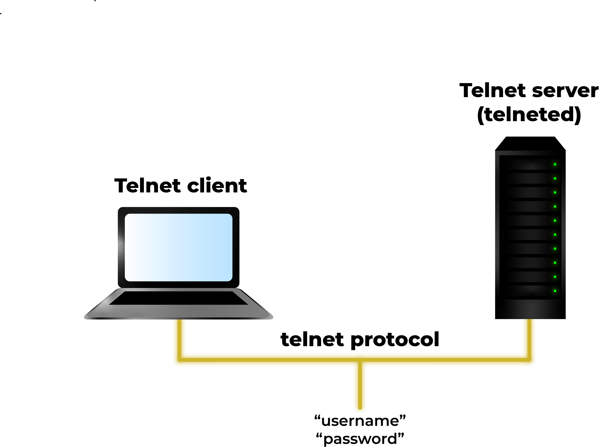
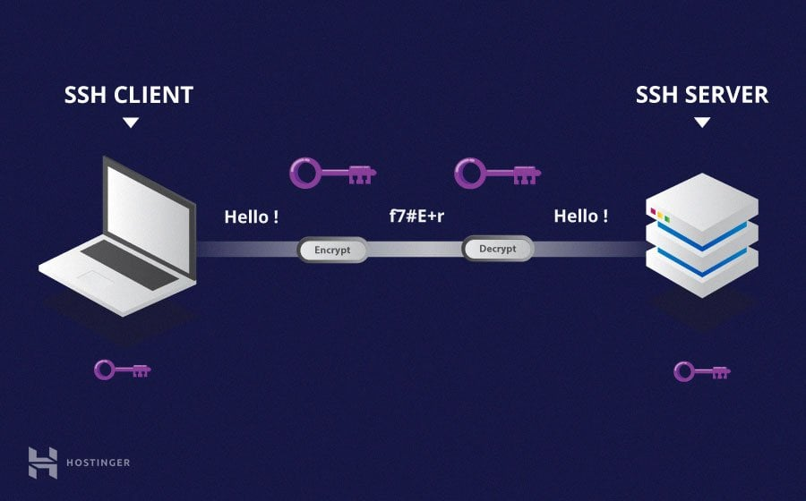

**Nama  :** Jordan Frisay Himawan  
**NRP   :** 3122600007  
**Kelas :** 2 D4 IT A  

`Tugas ini merupakan tugas mata kuliah Konsep Jaringan yang dibimbing oleh Bpk. Dr. Ferry Astika Saputra, ST, M.Sc`

# Telnet Protocol

#### :bulb: Apa itu Telnet?
Telnet merupakan protokol jaringan yang digunakan untuk mengakses komputer secara virtual dan menyediakan channel komunikasi berbasis teks diantara dua mesin. Telnet mengikuti perintah pengguna protokol jaringan TCP/IP untuk membuat sesi jarak jauh. Di web, HTTP dan FTP memungkinkan pengguna untuk meminta file tertentu dari komputer jarak jauh, sementara, melalui Telnet, pengguna dapat log on sebagai pengguna biasa dengan hak istimewa yang diberikan kepada pengguna tertentu aplikasi dan data di komputer itu.

#### :bulb: Bagaimana Telnet Bekerja?
Telnet adalah jenis protokol client-server yang dapat digunakan untuk membuka baris perintah pada komputer jarak jauh, biasanya server. Pengguna dapat menggunakan alat ini untuk melakukan ping ke port dan mengetahui apakah port tersebut terbuka. Telnet bekerja dengan memanfaatkan emulator koneksi terminal virtual, menggunakan protokol standar untuk bertindak seperti terminal fisik yang terhubung ke mesin. FTP juga dapat digunakan bersama dengan Telnet untuk pengguna yang berupaya mengirim file data.

Pengguna yang terhubung dari jarak jauh ke mesin menggunakan Telnet,  disebut sebagai Telnetting ke dalam sistem. Mereka diminta memasukkan kombinasi nama pengguna dan kata sandi untuk mengakses komputer jarak jauh, yang memungkinkan dijalankannya baris perintah seolah-olah login ke komputer secara langsung. Terlepas dari lokasi fisik pengguna, alamat IP mereka akan cocok dengan komputer yang digunakan untuk login, bukan dengan komputer yang digunakan secara fisik untuk terhubung.

#### :bulb: Karakteristik Telnet
- **Berbasis Teks**: Komunikasi menggunakan Telnet adalah berbasis teks. Ini berarti bahwa semua perintah, data, dan tanggapan ditransmisikan dalam bentuk teks biasa. 

- **Koneksi Jarak Jauh**: Telnet dirancang untuk memungkinkan akses ke perangkat atau sistem dari jarak jauh melalui jaringan komputer, seperti Internet. 

- **Port 23**: Port default untuk koneksi Telnet adalah port 23. Ini adalah port yang digunakan oleh klien Telnet untuk terhubung ke server Telnet. 

- **Koneksi Tidak Aman**: Salah satu karakteristik utama dari Telnet adalah bahwa itu tidak menyediakan enkripsi data. Ini berarti bahwa informasi yang dikirimkan antara klien dan server Telnet dapat dengan mudah disadap oleh pihak yang tidak berwenang. 

- **Tidak Memerlukan Aplikasi Khusus**: Telnet adalah protokol standar yang terintegrasi dalam banyak sistem operasi. Karena itu, Anda tidak perlu menginstal aplikasi khusus untuk menggunakan Telnet. 

- **Interoperabilitas**: Telnet dapat digunakan untuk terhubung ke berbagai jenis perangkat dan sistem, termasuk server, router, dan perangkat jaringan lainnya. Ini membuatnya serbaguna dan dapat diimplementasikan dalam berbagai lingkungan. 

- **Kontrol Perangkat Jarak Jauh**: Dengan menggunakan Telnet, pengguna dapat mengontrol perangkat atau sistem jarak jauh seperti mengonfigurasi pengaturan, mengelola file, menjalankan perintah, dan lain sebagainya. 

- **Legacy Protocol**: Meskipun Telnet masih digunakan dalam beberapa kasus, terutama dalam pengujian dan pengembangan atau di jaringan lokal yang terisolasi, ia telah digantikan oleh protokol yang lebih aman seperti SSH (Secure Shell) dalam sebagian besar skenario. 

#### :bulb: SSH dan Protokol Terkait
Beberapa sistem modern saat ini hanya mengizinkan koneksi command-line melalui SSH (Secure Shell), sebuah protokol terenkripsi yang mirip dengan telnet. Karena alasan keamanan, banyak organisasi professional mewajibkan penggunaan SSH, PuTTy, atau opsi protokol lain daripada Telnet. SSH merupakan alternatif Telnet yang umum digunakan  dikarenakan semua traffic yang melalui channel komunikasi SSH pasti akan dienkripsi. 

Tidak seperti protokol terbaru, Telnet tidak mendukung GUI. Membuatnya tidak kompatibel dengan banyak program modern, mulai dari program seperti spreadsheet hingga software simulator. Diarenakan program-program tersebut berjalan diatas GUI yang kompleks, sehingga akan banyak data yang hilang saat melalui sesi koneksi Telnet.

#### :bulb: RFC-854
RFC 854 adalah dokumen spesifikasi pertama untuk protokol Telnet, yang diterbitkan pada Mei 1983. Dokumen ini memberikan rincian tentang cara komunikasi Telnet bekerja. Berikut adalah ringkasan dari RFC 854:

- **Tujuan**: RFC 854 bertujuan untuk mendefinisikan protokol Telnet, yang memungkinkan pengguna untuk terhubung ke perangkat atau sistem jarak jauh melalui jaringan komputer dan berinteraksi dengan mereka seolah-olah mereka berada di dekatnya secara fisik. 

- **Format Pesan**: Dokumen ini memuat spesifikasi format pesan Telnet. Pesan Telnet terdiri dari baris teks ASCII yang mengandung karakter-karakter yang dapat dibaca manusia. 

- **Karakter Escape**: RFC 854 juga mendefinisikan karakter escape (sebagai contoh, IAC - Interpret As Command) yang memungkinkan Telnet untuk mengirim perintah atau mengidentifikasi penggunaan khusus dari karakter tertentu. 

- **Negosiasi Opsi**: Dokumen ini menjelaskan cara klien dan server dapat melakukan negosiasi opsi selama fase inisiasi koneksi. Ini termasuk pengaturan seperti karakter khusus atau pengaturan tampilan khusus. 

- **Contoh Skenario**: RFC 854 memberikan contoh-contoh skenario untuk memperlihatkan bagaimana koneksi Telnet harus diinisiasi, bagaimana pesan-pesan harus disusun, dan bagaimana opsi dapat dinegosiasikan. 

- **Status dan Pengaruh Lainnya**: RFC 854 menyatakan bahwa dokumentasi ini menggantikan RFC sebelumnya yang berkaitan dengan protokol Telnet dan menekankan pentingnya untuk implementasi yang konsisten di seluruh sistem. 

- **RFC Selanjutnya**: RFC 854 juga memberikan referensi terhadap dokumen-dokumen selanjutnya yang berkaitan dengan Telnet dan mengajak komunitas untuk mengirim saran atau perbaikan. 

Sementara RFC 854 adalah dokumen pertama yang mendefinisikan protokol Telnet, seiring berjalannya waktu, banyak RFC lainnya telah diterbitkan untuk memperluas atau memodifikasi fungsionalitas dan opsi Telnet, serta untuk mengatasi kelemahan keamanan yang terkait dengan protokol ini. 