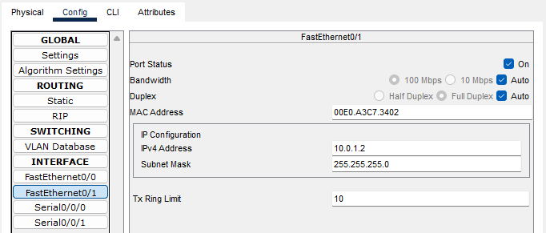
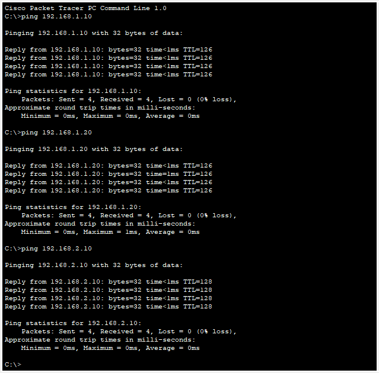

**Nama  :** Jordan Frisay Himawan  
**NRP   :** 3122600007  
**Kelas :** 2 D4 IT A  

`Tugas ini merupakan tugas mata kuliah Konsep Jaringan yang dibimbing oleh Bpk. Dr. Ferry Astika Saputra, ST, M.Sc`

# Cisco Packet Tracer

#### :bulb: Ping End Devices Melalui Router Berbeda
Ping adalah salah satu perintah yang digunakan dalam Packet Tracer, yang merupakan perangkat lunak simulasi jaringan yang dikembangkan oleh Cisco. Perintah ping digunakan untuk menguji konektivitas antara dua perangkat atau host dalam jaringan.

Contoh Koneksi antara device dan juga router yang berbeda. 

Dalam jaringan diatas menggunakan dua macam kabel yang berbeda, yakni:  

| Jenis Kabel| Penjelasan |
| -------- | -------- |
| **Copper Cross-over** (garis putus-putus) |  jenis kabel jaringan yang digunakan untuk menghubungkan dua perangkat jaringan serupa secara langsung. Ini biasanya digunakan untuk menghubungkan perangkat jaringan yang serupa, seperti komputer ke komputer, switch ke switch, atau router ke router, tanpa perlu perangkat tambahan seperti switch atau hub di antaranya. | 
| **Copper Straight-Through** (garis lurus)| Kabel Copper Straight-Through adalah jenis kabel jaringan yang paling umum digunakan untuk menghubungkan perangkat jaringan yang berbeda jenis, seperti komputer ke switch atau router. Dalam kabel straight-through, urutan pin pada satu ujung kabel sama dengan urutan pin pada ujung yang lainnya. Ini berarti bahwa sinyal transmit (TX) dari satu perangkat terhubung langsung ke sinyal receive (RX) pada perangkat yang lain, dan sebaliknya. |

#### :bulb: Detail Config Router dan End Devices
Setiap perangkat dalam jaringan memiliki alamat IP yang unik dan subnet mask yang sesuai. PC dalam jaringan yang sama (misalnya, PC1 dan PC2 di Switch 1) memiliki alamat IP dalam jaringan yang sama dengan subnet mask yang benar, sehingga mereka dapat berkomunikasi langsung satu sama lain tanpa perlu melibatkan router.

Router di sini berfungsi sebagai gateway untuk menghubungkan dua jaringan yang berbeda. Router 1 menghubungkan Jaringan A (192.168.1.0/24) dan Jaringan B (10.0.1.0/24), sedangkan Router 2 menghubungkan Jaringan A (192.168.2.0/24) dan Jaringan B (10.0.1.0/24).

Ketika PC ingin mengirim ping ke PC di jaringan yang berbeda, mereka akan mengirim paket ke gateway (router) mereka, yaitu Router 1 atau Router 2. Router akan memeriksa tabel rute dan meneruskan paket ke tujuan yang sesuai.

Dengan konfigurasi IP yang benar dan tabel rute yang sesuai di router, PC dapat mengirim ping satu sama lain melalui router dan antarmuka jaringan yang sesuai, sehingga memungkinkan komunikasi antar-jaringan.

- **Config Router 0:**   
  
  
 

- **Config Router 1:**  
  
  
 

- **Config End Device 0:**  
  
  

- **Config End Device 2:**  
  
  

- **Config End Device 1:**  
  
  

- **Config End Device 3:**  
  
  

#### :bulb: Hasil Percobaan Ping
Disini kita mengecek dengan menggunakan perintah ping antar end devices :

**Ping PC0 -> PC2, PC1, PC3:**  
  

**Ping PC2 -> PC0, PC1, PC3:**  
  

**Ping PC1 -> PC0, PC2, PC3:**  
  

**Ping PC3 -> PC0, PC1, PC2:**  
  