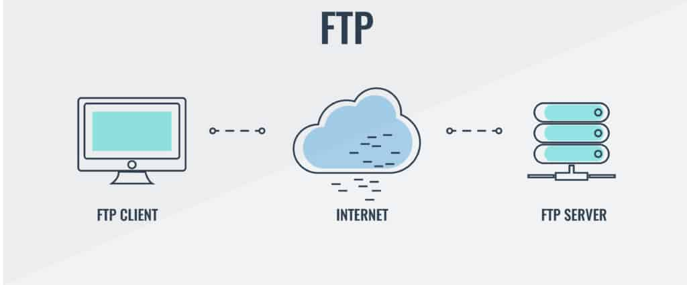

# Port FTP

#### :bulb: Apa Itu FTP?
FTP atau **File Transfer Protocol** merupakan protokol yang bertugas untuk menjembatani pertukaran informasi di dalam suatu komputer. Jika seseorang mengunduh dan mengunggah file, maka semua aktivitas tersebut dapat dilakukan dengan adanya bantuan FTP.

Dua hal penting dalam FTP adalah FTP server dan FTP client. FTP server adalah server yang menjalankan software dengan fungsi memberikan layanan tukar menukar file yang selalu siap apabila ada permintaan dari FTP client.
Sedangkan yang dimaksud dengan FTP client adalah komputer yang kamu gunakan untuk melakukan berbagai aktivitas. Komputer kamu sebagai FTP client haruslah terhubung dengan FTP server untuk bisa menukar file dan melakukan aktivitas seperti download, upload, rename, delete, dan sebagainya.

#### :memo: Mengapa Dalam Satu Port FTP Terdapat Dua Protokol TCP dan UDP?
Secara tradisional, protokol FTP (File Transfer Protocol) menggunakan protokol TCP (Transmission Control Protocol) untuk komunikasi antara klien dan server. TCP memastikan pengiriman data yang andal, terjamin, dan berurutan, yang sangat penting dalam transfer file yang memerlukan integritas data.

Namun, ada beberapa situasi di mana seseorang mungkin berusaha untuk menggabungkan FTP dengan UDP (User Datagram Protocol), meskipun ini bukanlah praktik standar dan memiliki beberapa kendala.

Alasan beberapa orang mungkin mempertimbangkan menggabungkan FTP dengan UDP adalah untuk mengurangi latensi dalam transfer file, terutama jika transfer file yang sangat besar harus dilakukan dalam waktu yang sangat singkat. UDP memiliki overhead yang lebih rendah daripada TCP karena tidak melibatkan mekanisme pengiriman yang rumit seperti ACK (Acknowledgment) dan pengaturan aliran yang ada dalam TCP. Namun, karena pengiriman dengan UDP tidak menjamin pengiriman yang andal, ini bisa berisiko dalam situasi di mana setiap bit data sangat penting.

Dalam beberapa kasus, pengembang mungkin mencoba memodifikasi protokol FTP atau menggunakan varian FTP yang berjalan di atas UDP untuk tujuan khusus. Namun, jenis implementasi semacam ini akan memerlukan pendekatan tersendiri untuk memastikan keandalan, keamanan, dan integritas data dalam skenario yang menggunakan UDP.

